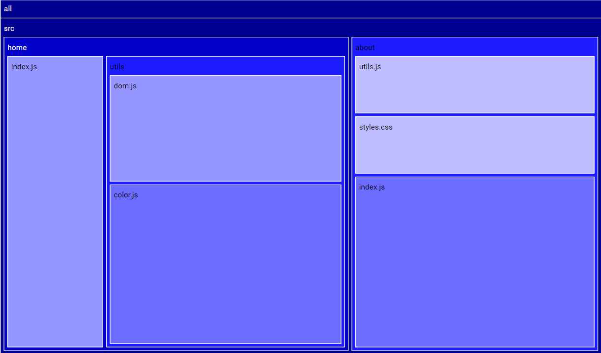

# Treemap-js

### How to use
#### Generate JSON
install dependencies 
```
pip install pydriller
```
set environment variables for the url of the repository to be analyzed and the metric used for generating the heatmap (frequency | complexity | loc_changes)
```
export REPOSITORY_URL=https://github.com/giselesousar/treemap-js 
export HEATMAP_METRIC=COMPLEXITY 
```
run in /scripts directory
```
python json.py
```
#### Render treemap
include treemap.bundle.js from dist directory in your html page
```html
<script src="treemap.bundle.js"></script>
```
get json data and render treemap into DOM
```js
// import JSON
import data from '/scripts/treemap.json';

// create json tree object
const tree = treemap.create(data);

// render treemap into dom element
treemap.render(tree, document.querySelector('.root'));
```
### Example 
```html
<!DOCTYPE html>
<html>
  <head>
    <title>Treemap</title>
  </head>
  <body>
    <div class="root" style="height: 100vh"></div>

    <script type="text/javascript" src="treemap.bundle.js"></script>
    <script type="text/javascript">
      fetch('example.json')
      .then((res)=> {
        return res.text();
      })
      .then((data) => {
        const tree = treemap.create(data);
        treemap.render(tree, document.querySelector('.root'));
      })
      .catch((err) => {
        console.log(err);
      });
    </script>
  </body>
</html>
```
### Output


### For development install dependencies and run scripts
```
$ npm install

$ npm run serve
$ npm run build

open http://localhost:3000/
```
